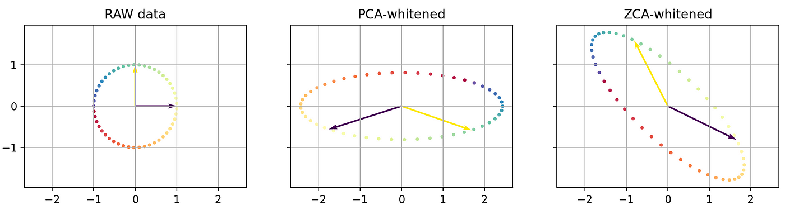

<!-- Improved compatibility of back to top link: See: https://github.com/othneildrew/Best-README-Template/pull/73 -->

<!--
*** Thanks for checking out the Best-README-Template. If you have a suggestion
*** that would make this better, please fork the repo and create a pull request
*** or simply open an issue with the tag "enhancement".
*** Don't forget to give the project a star!
*** Thanks again! Now go create something AMAZING! :D
-->

<!-- PROJECT SHIELDS -->
<!--
*** I'm using markdown "reference style" links for readability.
*** Reference links are enclosed in brackets [ ] instead of parentheses ( ).
*** See the bottom of this document for the declaration of the reference variables
*** for contributors-url, forks-url, etc. This is an optional, concise syntax you may use.
*** https://www.markdownguide.org/basic-syntax/#reference-style-links
-->

<!-- PROJECT LOGO -->
 

  

<h3 align="center">Python Whitening Algorithm: Enhancing Attack and Error Detection</h3>

  

    
  

<!-- TABLE OF CONTENTS -->

  
Table of Contents

  <ol>
    <li>
      <a href="#about-the-project">About The Project</a>
      <ul>
        <li><a href="#built-with">Built With</a></li>
      </ul>
    </li>
    <li>
      <a href="#getting-started">Getting Started</a>
      <ul>
        <li><a href="#prerequisites">Prerequisites</a></li>
        <li><a href="#installation">Installation</a></li>
      </ul>
    </li>
    <li><a href="#usage">Usage</a></li>
    <li><a href="#roadmap">Roadmap</a></li>
    <li><a href="#contributing">Contributing</a></li>
    <li><a href="#license">License</a></li>
    <li><a href="#contact">Contact</a></li>
    <li><a href="#acknowledgments">Acknowledgments</a></li>
  </ol>

<!-- ABOUT THE PROJECT -->
## Overview

The repository in question refers to the internship report: Whitening Algorithms. Here are three whitening algorithms used for testing:

* **whitening_eigendecomp.py**: Whitening algorithm that calculates eigenvalues and eigenvectors using eigendecomposition.
* **whitening_SVD.py**: Whitening algorithm that calculates eigenvalues and eigenvectors using SVD (Singular Value Decomposition).
* **whitening_Cholesky.py**: Whitening algorithm using Cholesky decomposition.

All other folders contain JSON data matrices used as input for the program and for conducting tests.

(<a href="#readme-top">back to top</a>)

## Additional Folders
* **CSV Algorithms Folder**: Contains algorithms used for testing but modified to read CSV files as input.

    - cvs_eig.py: Whitening algorithm with eigendecomposition.
    - csv_svd.py: Whitening algorithm with SVD.

* **Alternative Whitening SVD Folder**: Contains an alternative whitening algorithm to the one in the test folder, implemented for both CSV and JSON input files.
* **Chosen Multi Whitening Folder**: Contains a whitening algorithm that implements the 3 whitening methods, namely ZCA, PCA, and Cholesky, quickly but less specifically. Implemented for both JSON and CSV input files.
* **Basic Whitening Folder**: Contains two whitening algorithms simulating "whitening" of points on a Cartesian axis (specifically 5 and 1000 points), also showing the distribution result of these points after calculations, in PNG format using the Python matplotlib library. These images are found in the plot_img folder.
* **Verify Folder**: Contains algorithms to verify the correctness of equations in the theoretical part of whitening. In this algorithm, the dim.json matrix is used, with 11 rows and 10 columns. All matrices calculated by the algorithm are present in the Result folder and described in the theory.pdf file.
* **CSV Input Folder**: Contains some CSV files for algorithm input, same for the input_txt folder.

For correctness tests, the verify_log.py program was used, which verifies equation 2 in terms of error percentage, equation 3 and equation 4 in terms of average error compared to the ideal matrix. All logs, hence correctness checks, are found in the log.txt file.

### Built With

* Python

(<a href="#readme-top">back to top</a>)

<!-- GETTING STARTED -->
## Objective

The main goal of this repository is to develop effective whitening algorithms to enhance network security and data transmission.

## Key Features
- [ ] **Data Whitening**: The algorithm employs whitening techniques to randomize the input data, making it more difficult for attackers to exploit patterns or weaknesses.
- [ ] **Error Detection**: It includes built-in error detection mechanisms to identify and correct potential errors that may occur during data transmission.
- [ ] **Customization**: Users can adjust parameters to fine-tune the whitening process according to their specific requirements and data characteristics.
- [ ] **Ease of Integration**: The Python Whitening Algorithm is designed for easy integration into existing systems and applications.

## Applications
This Python Whitening Algorithm finds application in several critical areas:
* **Network Security**: Enhances the detection of network intrusion attempts by making it challenging for attackers to predict patterns in network traffic.
* **Data Transmission**: Minimizes the impact of data transmission errors by increasing the robustness of data streams, reducing the chances of data corruption during transit.
* **Cryptography**: Can be integrated into cryptographic systems to improve the security of data encryption and decryption processes.
* **Communication Systems**: Used in communication systems to reduce the probability of data corruption and improve the overall reliability of data transfer.

## Development Details
**Technology Stack**
* **Programming Language**: Python
* **Data Transformation**: Various statistical and mathematical techniques for data whitening.

## Challenges
Developing the Python Whitening Algorithm presented several challenges:

* **Optimal Whitening**: Determining the most suitable whitening technique for various data types and applications.
* **Error Handling**: Designing robust error detection and correction mechanisms to ensure the integrity of whitened data.
* **Performance**: Balancing the trade-off between whitening effectiveness and computational overhead.
For more details, refer to the documentation and source code provided in this repository. Feel free to contribute and provide feedback to further improve the algorithm.

<!-- CONTRIBUTING -->
## Contributing

Contributions are what make the open source community such an amazing place to learn, inspire, and create. Any contributions you make are **greatly appreciated**.

If you have a suggestion that would make this better, please fork the repo and create a pull request. You can also simply open an issue with the tag "enhancement".
Don't forget to give the project a star! Thanks again!

1. Fork the Project
2. Create your Feature Branch (`git checkout -b feature/AmazingFeature`)
3. Commit your Changes (`git commit -m 'Add some AmazingFeature'`)
4. Push to the Branch (`git push origin feature/AmazingFeature`)
5. Open a Pull Request

(<a href="#readme-top">back to top</a>)

<!-- LICENSE -->

<!-- CONTACT -->
## Contact

Emanuele Bevacqua - emanuelebev@gmail.com

Project Link: [https://github.com/emanuelebev](https://github.com/emanuelebev/)

(<a href="#readme-top">back to top</a>)

<!-- MARKDOWN LINKS & IMAGES -->
<!-- https://www.markdownguide.org/basic-syntax/#reference-style-links -->
[contributors-shield]: https://img.shields.io/github/contributors/github_username/repo_name.svg?style=for-the-badge
[contributors-url]: https://github.com/github_username/repo_name/graphs/contributors
[forks-shield]: https://img.shields.io/github/forks/github_username/repo_name.svg?style=for-the-badge
[forks-url]: https://github.com/github_username/repo_name/network/members
[stars-shield]: https://img.shields.io/github/stars/github_username/repo_name.svg?style=for-the-badge
[stars-url]: https://github.com/github_username/repo_name/stargazers
[issues-shield]: https://img.shields.io/github/issues/github_username/repo_name.svg?style=for-the-badge
[issues-url]: https://github.com/github_username/repo_name/issues
[license-shield]: https://img.shields.io/github/license/github_username/repo_name.svg?style=for-the-badge
[license-url]: https://github.com/github_username/repo_name/blob/master/LICENSE.txt
[linkedin-shield]: https://img.shields.io/badge/-LinkedIn-black.svg?style=for-the-badge&logo=linkedin&colorB=555
[linkedin-url]: https://linkedin.com/in/linkedin_username
[product-screenshot]: images/screenshot.png
[Next.js]: https://img.shields.io/badge/next.js-000000?style=for-the-badge&logo=nextdotjs&logoColor=white
[Next-url]: https://nextjs.org/
[React.js]: https://img.shields.io/badge/React-20232A?style=for-the-badge&logo=react&logoColor=61DAFB
[React-url]: https://reactjs.org/
[Vue.js]: https://img.shields.io/badge/Vue.js-35495E?style=for-the-badge&logo=vuedotjs&logoColor=4FC08D
[Vue-url]: https://vuejs.org/
[Angular.io]: https://img.shields.io/badge/Angular-DD0031?style=for-the-badge&logo=angular&logoColor=white
[Angular-url]: https://angular.io/
[Svelte.dev]: https://img.shields.io/badge/Svelte-4A4A55?style=for-the-badge&logo=svelte&logoColor=FF3E00
[Svelte-url]: https://svelte.dev/
[Laravel.com]: https://img.shields.io/badge/Laravel-FF2D20?style=for-the-badge&logo=laravel&logoColor=white
[Laravel-url]: https://laravel.com
[Bootstrap.com]: https://img.shields.io/badge/Bootstrap-563D7C?style=for-the-badge&logo=bootstrap&logoColor=white
[Bootstrap-url]: https://getbootstrap.com
[JQuery.com]: https://img.shields.io/badge/jQuery-0769AD?style=for-the-badge&logo=jquery&logoColor=white
[JQuery-url]: https://jquery.com 
